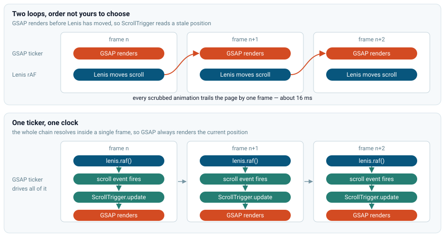
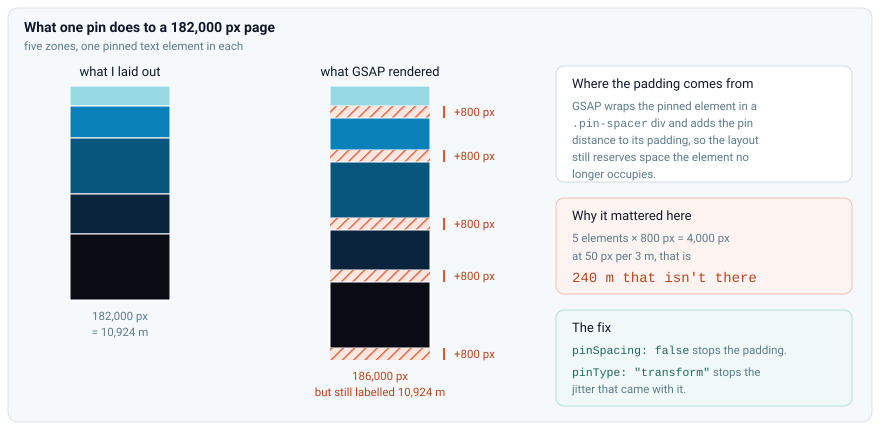
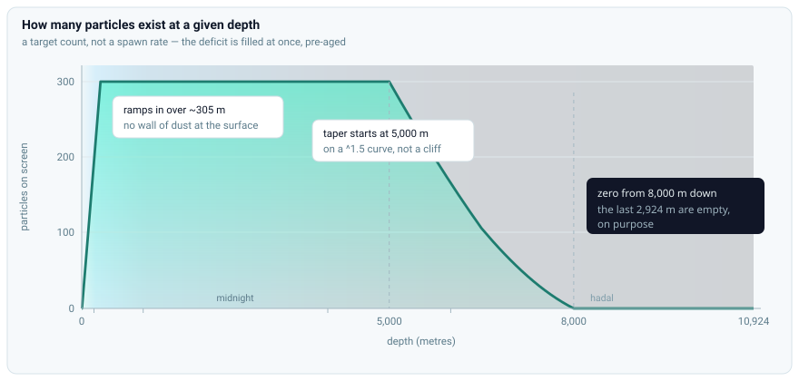
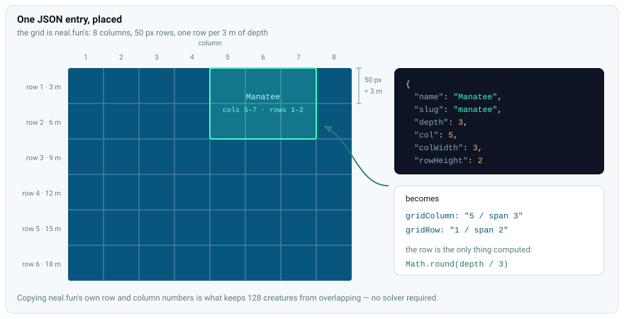
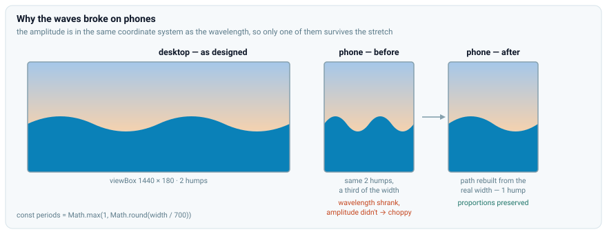
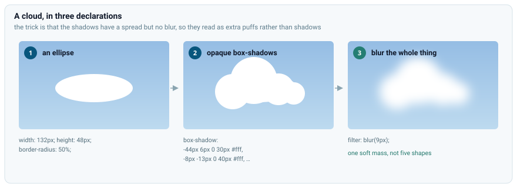

# Building an ocean you can scroll to the bottom of

**[Live demo →](https://mohammed-alaklouk.github.io/The-deep-ocean/)**

Have you seen those sites with the fancy scroll animations like the ones on [Awwwards](https://www.awwwards.com/websites/gsap/)? I had never written a scroll-based animation before and didn't know what was actually behind that effect. I thought it would be fun to try to make one myself and learn some new techniques along the way.

I remembered seeing this site called [The Deep Sea](https://neal.fun/deep-sea/) by [neal.fun](https://neal.fun/). You scroll down through the depths and sea creatures appear at their real depths, and it just keeps going on and on. It makes you feel how deep the ocean really is. It's a great piece of work, go play with it before reading any further.

It was the perfect inspiration for my project. I rebuilt it. Same concept, a 10,924 meter descent, 128 creatures at their real depths, my own hero design and particle system. It's plain HTML, CSS, JavaScript, plus GSAP and Lenis.


## GSAP and Lenis
[GSAP](https://greensock.com/) or GreenSock Animation Platform is a powerful library for creating smooth and performant animations. You give it a target element, the final and initial properties you want to animate, and the duration of the animation. It handles all the math and timing for you with an interpolation function of your choosing. You can chain animations together through timelines. You can use plugins to change the behavior of the animations. I used the [ScrollTrigger](https://greensock.com/scrolltrigger/) plugin to trigger animations and interpolate based on the scroll position instead of time. It has a built-in scrub feature that allows you to tie the progress of an animation to the scroll position. This is perfect for creating scroll-based animations.

However, the default scroll behavior of the browser is not very smooth. It can feel very janky and inconsistent, especially on mobile devices. That's where [Lenis](https://www.lenis.dev/) saves the day. It is a library that smooths out the scroll behavior of the browser by using requestAnimationFrame and easing functions. It provides a simple API to control scroll behavior and lets you define custom callbacks for scroll events.

## Getting them to work together

You would think these two would fight over who controls the scrolling, but they don't. ScrollTrigger never scrolls anything. It only reads how far down the page you are. And Lenis doesn't replace the scroll position either; it works out a smoothed value each frame and hands it to `window.scrollTo`. The page's real scroll position is the true one the whole time, which is why I never needed ScrollTrigger's `scrollerProxy`.

The actual problem is frames. Lenis needs something to advance it once per frame, and GSAP is already running its own loop to render tweens. Two loops means two callbacks every frame, in an order you didn't choose, and if GSAP renders before Lenis has moved, ScrollTrigger reads a scroll position that is one frame old. Every scrubbed animation ends up trailing the page by about 16ms. It doesn't look like a bug. It just makes the whole page feel slightly disconnected from your input.

Three lines fix it:

```js
lenis.on('scroll', ScrollTrigger.update);
gsap.ticker.add((time) => lenis.raf(time * 1000));
gsap.ticker.lagSmoothing(0);
```

The first line is the important one. Lenis fires its `scroll` event synchronously when it changes the scroll position, so I gave it a callback to tell ScrollTrigger to update its internal state immediately. That way, when GSAP renders, it has the updated scroll position.

The second line gets rid of Lenis's own loop and drives it from GSAP's ticker instead, so there is one loop and one clock. Now GSAP runs its loop -> calls Lenis to update -> Lenis fires the scroll event -> ScrollTrigger updates its state -> GSAP renders. All in one frame. Note that Lenis's `.raf()` expects a time in milliseconds, but GSAP's ticker gives it in seconds, so I multiply by 1000.

GSAP has a feature where it lies to its ticker about how long the last frame took if it was over 500ms. This is so animations don't jump around if the page lagged for a while. But Lenis relies on the delta time being precise to scroll smoothly. If that feature was on, then if the user scrolls quickly or experiences lag, the animation will not respond to their input. The third line disables this feature.



## The Zones

The site covers a depth of 10,924 meters. This is very long for a single page, especially when it's mostly empty. I use a scale of 50 pixels per 3 meters inherited from the grid the original site placed its creatures on, so its row data would line up with mine. This means the page is around 182,000 pixels long.

The ocean is divided into these five zones: 
- The sunlight zone (0–200 m)
- The twilight zone (200–1,000 m)
- The midnight zone (1,000–4,000 m)
- The abyssal zone (4,000–6,000 m)
- The hadal zone (6,000–10,924 m)

The zones are represented by a full-width div with a height of the zone's depth in pixels. I store each zone's span and resize the divs on startup. Each zone has a different background gradient and has a different number of particles to give a different feel to each. The background gradients go from light to dark as you go deeper, and the particles are more sparse in the deeper zones. I store the colors as CSS variables so I can reuse them in different parts of the design.

### The depth meter
I needed to tell the user how deep they were, so I added a depth meter that shows the current depth in meters. It is centered horizontally and fixed at 70% of the viewport height. It updates its value based on the scroll position and the scale factor.

Determining the depth is a bit tricky because the page includes elements other than the zones. I get the top position of the zones relative to the viewport and the height of the zones. The counter is offset at 70% of the viewport height, which works out to (0.7 * window-height - relativeTop) / zonesHeight. I then clamp the value between 0 and 1 and multiply it by the total depth to get the current depth in meters.

```js
function updateDepthCounter() {
  const rect = zonesContainer.getBoundingClientRect();
  if (!rect.height) return;
  const counterRefY = 0.7 * window.innerHeight;        // counter line, in viewport coords
  const progress = (counterRefY - rect.top) / rect.height;
  const depth = Math.round(Math.max(0, Math.min(1, progress)) * totalDepth);
  scrollDiv.textContent = `${depth} m`;
}
```

I hide it until the user is already in the sunlight zone, then I start a GSAP tween to slide it in with a subtle fade. I also unstick it when the user scrolls past the last zone, so it doesn't overlap with the footer. 

## The glass cards
I really like the glassy text effects Apple uses. I wanted to see how they're made and if I could make them myself. Turns out, it's just a blur, a gradient, and a smart box-shadow and border. 

I have a blur filter on the background. Anything behind the text will be blurred and show up through it. I saturate the colors so they pop more. To make it look like an actual piece of glass interacting with light, I add a diagonal gradient that goes from a light gray to a darker gray. The border makes it look like a glass pane with actual edges. The box-shadow adds a subtle drop shadow to make it look like it's floating above the background.

```css
.glass-card {
  background: linear-gradient(
    135deg,
    hsl(0 0% 100% / 0.34) 0%,
    hsl(0 0% 100% / 0.16) 55%,
    hsl(0 0% 100% / 0.24) 100%
  );
  border: 1px solid hsl(0 0% 100% / 0.28);
  border-radius: 16px;
  -webkit-backdrop-filter: blur(16px) saturate(130%);
  backdrop-filter: blur(16px) saturate(130%);
  box-shadow:
    0 4px 18px hsl(220 45% 11% / 0.12),      /* soft drop shadow */
    inset 0 1px 0 hsl(0 0% 100% / 0.3);      /* faint top sheen  */
}
```


## Text animations

I wanted the text to slide in with a subtle fade, stay on screen for a while, and then leave. I built that in three parts for each text element in the zones, using GSAP's `fromTo` method to animate the opacity and y position, and ScrollTrigger to drive it from the scroll position. Only the entrance needed a movement of its own. On the way out the text just fades, and the page scrolling normally carries it up and away.

### The pin that stretched the page

GSAP has a built-in pin feature to freeze an element in place while you scroll. I reached for it without thinking much of it, but to my surprise I found the height of the zones had gotten all messed up and they were a lot longer than they should be. 

This is a quirk of how GSAP does its pinning. It wraps the element in a div with a pin-spacer class and adds the pin span in px to the pin-spacer's padding. This of course makes the zones longer and messes up the math. Each element is pinned for 800px, which is 48 meters, and with 5 text elements that adds up to 4000px or around 240 meters. I used the pinSpacing:false option to prevent GSAP from adding extra space for the pin and it worked, but the text would sometimes jitter between transitions, so I used pinType:"transform", which updates the transform property instead of the position property.



All three parts together:

```js
// 1. Entrance: fades in as zone scrolls up into view
gsap.fromTo(textEl,
  { opacity: 0, y: 30 },
  {
    opacity: 1,
    y: 0,
    scrollTrigger: {
      trigger: parentZone,
      start: "top bottom",
      end: "top top+=100px",
      scrub: true,
    }
  }
);

// 2. Pin: freezes in place for the rest of the zone, while the zone scrolls past
gsap.fromTo(textEl,
  { y: 0 },
  {
    scrollTrigger: {
      trigger: parentZone,
      start: "top top",         // Starts pinning when the zone reaches the top of the viewport
      end: "top top-=800px",    // Ends exactly 800px later
      scrub: true,
      pin: textEl,
      pinSpacing: false,
      pinType: "transform",
    }
  }
);

// 3. Exit: fades out WHILE drifting up naturally
gsap.fromTo(textEl,
  { opacity: 1 },
  {
    opacity: 0,
    immediateRender: false,
    scrollTrigger: {
      trigger: parentZone,
      start: "top top-=800px",  // Starts fading EXACTLY when the pin unlocks
      end: "top top-=1300px",
      scrub: true,
    }
  }
);
```

## The particles

Particles are a big part of the design. They give the ocean a sense of depth and movement and emphasize how barren the deeper zones are.

Each particle stores its own position, velocity, and lifespan. They are generated randomly across the canvas, plus a buffer past each edge so they can drift in from offscreen, and each one gets a random velocity and lifespan. They are updated every frame and removed when they go out of bounds or their lifespan is over. Particles move around and pulse slowly to give the ocean a sense of movement. 

I also made them shift their position as the user scrolls. To make it more interesting, I gave each particle its own random distance from the camera, and they react to the scroll differently based on that distance. The closer they are, the more they move with the scroll. The farther they are, the less they move with the scroll. This gives a parallax effect and makes the ocean feel more 3D.

I first made it so each zone has its own likelihood of spawning a particle, but that made the transitions between zones look weird and uneven. So I interpolated the spawn rate based on depth instead, and that got me better results. 

A new problem arose with the spawns. Basically, they would take a while to populate the areas you scrolled to because only one particle could spawn per frame. To fix this, I ditched the spawn rate and instead opted for a target count, where based on how deep you are, a certain number of particles will be spawned. To make it look like the particles have been there all along, instead of creating the particles at age 0, I randomly pre-age them.

The count tops out at 300. It ramps up over the first few hundred meters, starts tapering at 5,000 m, and reaches zero at 8,000 m, so the bottom of the hadal zone is completely empty. That's the point.




## Creatures

The original site had 128 creatures.

It's always a good idea to isolate your data from the code and I didn't want my creatures.js to be 1000+ lines. I decided to store their data in a JSON file instead.

I experimented with AI in the project. I made a Claude agent handle the positions and sizes.

My first schema was just a depth and a scale multiplier per creature. Claude got the depths right. It used the average depth each creature stays at, but it completely hallucinated the scales. It was so bad that it made the polar bear the same size as a clownfish (2-5 inches). I then made it use a tiered classification system where small fish are almost the same size, then medium animals, then big sharks/whales etc. That did the trick.

After the scale was done, I tackled the positions. At this point each creature's position was its average depth with a random x offset, which made the creatures draw over each other and was a big mess in the higher zones because they had most of the creatures. When I brought that to Claude's attention, it wrote a python script that calculated the final image sizes and positions in pixels on the page, then it used a complex algorithm to just nudge the creatures around so they don't overlap. It took a really, really long time to do that and it looked so bad at the end.

I was done with its ideas and made it scan the original site and get the positions from there. The site was using a grid and represented the position with columns and rows, and the size with column width and height. I used the same approach and made it copy the values into the json file. One entry looks like this:

```json
{
  "name": "Manatee",
  "slug": "manatee",
  "depth": 3,
  "col": 5,
  "colWidth": 3,
  "rowHeight": 2
}
```

`col`, `colWidth` and `rowHeight` go straight onto the CSS grid. The row comes from the depth: at 3 meters per row, it's just `Math.round(depth / 3)`. That's the whole placement system, and it's why the page had to be scaled at 50 pixels per 3 meters in the first place.




Loading this many images all at once and making the site wait for them will make the site stutter on load, so I lazy loaded them with native `loading="lazy"` and `decoding="async"`, no library. Lazy loading usually costs you layout shift as images pop in, but not here. The grid cell already reserves its space from the row and column data, so there's nothing for the image to push around when it arrives.

I gave each creature a simple entrance animation where they fade in with a blur and a small displacement. On the way out they fade and blur back out, without the displacement. Drifting up and away at the same time looked like too much.

## Getting around 182,000 pixels
The page is very long and that causes a big problem: nobody wants to scroll all that by hand, and once you're a good amount through the site there is no convenient way to go back. 

I added five dots on the right edge, each for one of the zones. The dot for whichever zone you are scrolling through is filled. Clicking a dot scrolls you to its corresponding zone. They fade in the same way as the depth meter and unpin near the footer.  

The one I like more is the auto-scroll button. When you click it, it does the scrolling for you. It scrolls slowly and it feels kind of like you're sinking. I made it so it's slow enough you can register the creatures as they pass, but fast enough that the lower zones are not a grueling black screen.

To make it feel right I measure the speed in screenfuls per second instead of pixels per second, as follows:

```js
const screenfuls = (toY - fromY) / window.innerHeight;
lenis.scrollTo(toY, { duration: screenfuls / screensPerSec, easing: (t) => t });
```

A fixed pixels-per-second scroll would give users a different experience if they had a shorter screen. The creatures would just zip through the smaller screen length quickly. Dividing by the viewport height gives everyone the same pace. The easing is important too. GSAP and Lenis both default to an ease-in-out, which would make the descent inconsistent, so I dropped it.

One more thing was needed. Going full speed from standing in the hero felt too abrupt, so I ramp up the speed in the first 500 meters. It starts at half speed then goes linearly to full speed. This also has a cool side effect where you spend more time in the creature-dense parts, which I think is better than going at full speed through them. Any wheel, touch, or key input cancels the scroll immediately. 

I put a back-to-top button that works the same way, screenfuls-per-second and linear easing, just about fourteen times faster. It's a long way up.

## The hero

For the hero I followed the original design but wanted to give it some zest. I wanted it to look like a sunset. A warm background, some clouds, waves and text in the middle.

I started with the text. The hero reads "Let's explore the" on one line and "Ocean" on the next. I used a different font for each, and sized "Ocean" so it spans nearly the full width of the line above it, so it pops out. I gave it a simple fade / slide in animation, then it idles bobbing up and down. When you scroll it slides out.

### The gradient
The gradient on the "Ocean" text was pretty tricky. CSS only lets you set text color as a solid color, so I had to improvise. I gave the background a gradient and made it only show behind the rasterized letters with `background-clip: text`. Then I made the text color transparent and voilà. 

```css
.hero-title {
  background: linear-gradient(160deg, hsl(220 45% 11%) 30%, hsl(190 70% 35%) 100%);
  -webkit-background-clip: text;
  background-clip: text;
  -webkit-text-fill-color: transparent; /* Overrides `color` from any other rule that applies */
  color: transparent;
}
```

### The sun
The big 'O' looked like the sun, so I decided to put the sun inside of it. 

The sun is pretty simple. The body is just a radial gradient, the light is a box shadow. I blur the whole thing and change the blend mode to screen so it affects the elements around it.

It's my favorite part of the design. 

```css
.sun {
  position: absolute;
  top: 50%;
  left: 50%;
  transform: translate(-50%, -50%);
  width: 0.5em;
  height: 0.5em;
  border-radius: 50%;
  background: radial-gradient(
    circle,
    hsl(45 100% 92%) 0%,
    hsl(38 90% 72%) 40%,
    hsl(28 85% 58%) 100%
  );
  box-shadow:
    0 0 0.2em 0.1em hsl(40 90% 70% / 0.7),
    0 0 0.6em 0.25em hsl(33 80% 60% / 0.5),
    0 0 1.2em 0.5em hsl(28 70% 55% / 0.3),
    0 0 2em 1em hsl(28 70% 55% / 0.15);
  filter: blur(4px);
  mix-blend-mode: screen;
  pointer-events: none;
  z-index: -1;
}
```

### The waves
I stacked three SVGs of quadratic Bézier waves on top of each other, each with its own color. I wrote a keyframe with a different duration for each one so their cycles never sync up, and made each wave's movement direction opposite to the other two so they look organic. That was enough to sell it.

I added a buoy to make the scene feel alive; it's also a bunch of SVGs stitched together, and it just bobs up and down.

I've encountered a few issues with the waves. 

First off, sometimes a few rows of pixels would be a different color between the waves and the zone. When the waves moved, the top wave could slide up so much the lower layers would show through, and if you're lucky even the hero background itself. I fixed this by making the waves taller and shifting them down. I also changed the sunlight zone's color to be the same as the wave, and now they all blend together and you don't notice. 

Mobile messed up those waves so much. Because their view box's dimensions were fixed and got stretched with `preserveAspectRatio="none"`, they got squeezed into less space on smaller screens so they looked compressed and choppy. I fixed that by constructing the waves based on the screen width on load and resize. I also gave them fewer humps on smaller screens. 



Even the buoy wasn't safe from mobile. I gave it a fixed position, but because the waves change based on the screen width, this position could land on a peak or trough, so it was frequently floating in mid-air. I fixed this by doing a binary search along the front wave for its actual height under the buoy and anchoring it to that. This also runs on load and resize. 

### The clouds
I used a few clever tricks for the clouds. The cloud is a div with `border-radius: 50%;` so it's an ellipse. I specify the width and height per cloud separately. Then I add a few box shadows with no blur and a spread radius to each cloud. Because I'm not blurring, the shadows are opaque; they act like extra puffs at different sizes and offsets. Then I blur the whole thing, and now they look like one soft and fluffy mass.

That got me a pretty convincing cloud. Then I make them drift 100vw from their starting position to the right. I gave them durations from 45s to 65s. Bigger clouds are slower and more transparent so they look far away.



## Reduced motion
The site is full of moving and scaling elements. For people with vestibular disorders or motion sensitivity, that kind of design makes them dizzy and nauseous. I listen for prefers-reduced-motion; when it's set, I disable smooth scrolling and the browser's native scroll takes over, the particle system gets a 0 target all the time so it's disabled, and the ambient loops like the waves, the clouds, and the bobbing buoy are cancelled.

I had to think hard about the scroll-driven entrances. I first disabled them too, but that made them either too boring or just pop in with no transition. I decided to drop the movement in the animations and keep the fade-in. Reduced motion doesn't mean no animations, just no motion. 

## What I ended up learning
I started this project wanting to learn scroll animations, and that turned out to be the simplest part of it. Setting up an animation is as easy as defining the start and end properties and passing an element identifier alongside them. The scroll animations were also very simple, just three lines to sync GSAP and Lenis, and a `scrub: true` in the animation. This part was mostly reading docs and looking up examples.  

Everything else was a different kind of problem. The weird responsiveness issues with the waves and the buoy have taught me a lot about how to debug and profile a page. The pin issue was a side effect that would have no real impact on a normal site, and it made a lot of sense once I understood it. It taught me to dig into how things work under the hood to understand the "random" behaviors. 

## On using AI
The creatures in particular taught me a lot about the limitations of AI and how to best use it in projects moving forward. I originally wrote a basic skeleton of the site myself then decided to try out vibe coding, but that wasn't really a good idea. AI isn't great at integrating systems together so it performs poorly on projects that get revised constantly and things get added to them frequently. I had to rewrite the entire particle logic, large parts of the creature logic, and large parts of script.js, and parts of them are still sketchy. It writes long and descriptive comments but a lot of times it just makes up why a change is happening or what the change is.

This actually made it pretty hard to trace what changed and why, alongside lots of implementation details, because I didn't go over everything that it wrote. Also there were plenty of times where it was just faster for me to write the code myself because of how long it needs to think, and how long it would take me to verify the code it wrote, and that's even if what it wrote actually worked. To save time I didn't verify a lot of the code when it was written and that led to a whole lot of bugs. AI is a powerful tool but that is all it is, a tool. It performed poorly when I treated it more as a developer than a tool. 

Overall this project has taught me a lot about web development, project management, debugging and profiling, and AI usage. I had a blast building this site.

Check out the site here **[Live demo →](https://mohammed-alaklouk.github.io/The-deep-ocean/)** · **[Source on GitHub →](https://github.com/Mohammed-ALAklouk/The-deep-ocean)**

